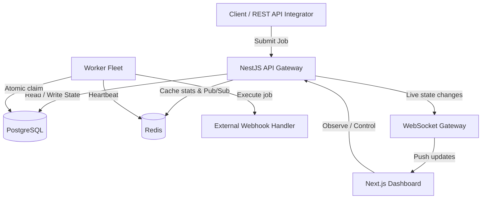

# Aurora Scheduler ⚡

A robust, production-inspired distributed job scheduling platform designed to run asynchronous background work reliably at scale.

Aurora provides atomic job claiming (zero duplicate execution), configurable retry strategies, dead-letter queue (DLQ) parkings, and real-time observability via a premium Web Dashboard.

---

## 🏗️ Architecture



---

## 📁 Repository Structure

```
aurora-scheduler/
├── apps/
│   ├── api/                    # NestJS REST & WebSocket API Gateway
│   ├── worker/                 # Standalone NestJS Worker Service
│   └── web/                    # Next.js 14 Dashboard
└── README.md                   # This instruction manual
```

---

## 🚀 Quick Start (Local Development)

### Prerequisites
- [Node.js](https://nodejs.org/) v20+
- [pnpm](https://pnpm.io/) v9+

### Setup and Run the API and Worker Fleet
Ensure you have configured database and cache credentials in the `.env` files of `apps/api` and `apps/worker`, then install dependencies workspace-wide and start the development servers:
```bash
# Install workspace dependencies
pnpm install

# Start all three applications (API, Worker, Dashboard) in parallel dev mode
pnpm dev
```

The system will start with:
- **API Gateway**: http://localhost:3001
- **API Docs (Swagger)**: http://localhost:3001/api/docs
- **Web Dashboard**: http://localhost:3000
- **WebSocket Namespace**: `http://localhost:3001/events`

---

## 🔐 Credentials & Seeding
On the first run, the database is **seeded automatically** with:
- **Default User**: `demo@aurora.dev`
- **Default Password**: `demo12345`
- **Pre-configured API Key**: `ak_demo_project_key` (use header `X-API-Key: ak_demo_project_key` for direct API requests)
- **Queues**: `default-queue` (exponential backoff) and `email-delivery` (linear backoff)

---

## 🛠️ API & Command Reference

### Submit an Immediate Job
```bash
curl -X POST http://localhost:3001/api/jobs \
  -H "Content-Type: application/json" \
  -H "X-API-Key: ak_demo_project_key" \
  -d '{
    "queueId": "YOUR_QUEUE_UUID",
    "type": "immediate",
    "payload": { "email": "user@gmail.com", "action": "send_welcome" }
  }'
```

### Submit a Delayed Job (Run in 5 minutes)
```bash
curl -X POST http://localhost:3001/api/jobs \
  -H "Content-Type: application/json" \
  -H "X-API-Key: ak_demo_project_key" \
  -d '{
    "queueId": "YOUR_QUEUE_UUID",
    "type": "delayed",
    "delayMs": 300000,
    "payload": { "backupId": "db_daily_992" }
  }'
```

### Submit a Recurring Cron Job
```bash
curl -X POST http://localhost:3001/api/jobs \
  -H "Content-Type: application/json" \
  -H "X-API-Key: ak_demo_project_key" \
  -d '{
    "queueId": "YOUR_QUEUE_UUID",
    "type": "cron",
    "cronExpression": "0 2 * * *",
    "payload": { "task": "daily_reconciliation" }
  }'
```

---

## 🧪 Testing

### Unit Tests
To execute backend service state machine and backoff calculation tests:
```bash
pnpm --filter @aurora/api run test
```
